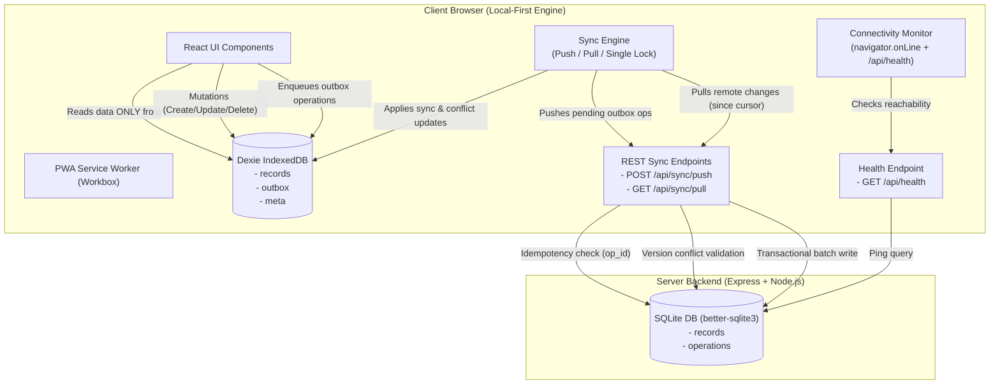

# SyncNote — Offline-First Notes & Tasks Manager (ALG-WEB-02)

> **One-Line Problem Statement:** Standard web applications crash, fail to load, or lose unsaved user edits when network connectivity drops or fluctuates during active workflows.

**SyncNote** is an offline-first, local-first Notes and Tasks Manager built for the **ALG-WEB-02 Hackathon Challenge**. The UI reads application state **exclusively from IndexedDB**, allowing users to create, edit, search, and delete records seamlessly without an active internet connection. Uncommitted mutations are enqueued in an IndexedDB outbox queue, automatically synchronized to an Express/SQLite backend upon reconnection using idempotent operations, server-owned version numbers, and user-controlled conflict resolution.

---

## 🌟 Key Features

* **100% Offline-First (IndexedDB via Dexie.js):** The React UI never fetches records directly from network APIs. All reads and mutations interact instantly with local IndexedDB storage.
* **Client-Generated UUIDs:** Every record and operation uses client-generated UUIDs (`crypto.randomUUID()`), enabling offline creation without waiting for server auto-increments.
* **IndexedDB Outbox Mutation Queue:** Enqueues local create, update, and delete mutations with automatic outbox coalescing (rules 1–4) to prevent redundant network transmissions.
* **Idempotency (`opId`):** Server tracks unique operation UUIDs in SQLite to guarantee safe retries without duplicate record creation or state corruption.
* **Version-Based Conflict Detection (`409 Conflict`):** Compares operation `baseVersion` against current SQLite record version. Stale mutations return HTTP 409 Conflict without silently overwriting server data.
* **Interactive Side-by-Side Conflict Resolution:** Surfaces version conflicts in a Google Stitch-styled side-by-side diff visualizer offering **Keep Mine (Local)**, **Keep Theirs (Cloud)**, and **⚡ Merge Manually** options.
* **PWA Offline Shell (`vite-plugin-pwa` / Workbox):** Full offline application loading via Service Worker caching (`dist/sw.js`).
* **Hybrid Connectivity Monitor:** Combines `navigator.onLine` events with periodic `/api/health` pings to distinguish local network connection from real server reachability.
* **Bounded Exponential Backoff:** Automatic retries (1s up to 30s max) when server drops or network fails during push/pull synchronization.

---

## 🛠️ Technology Stack

| Layer | Technology | Purpose |
|---|---|---|
| **Frontend Framework** | React 18 + Vite 6 + TypeScript | High-performance reactive client bundle |
| **Local Database** | IndexedDB via Dexie.js & `dexie-react-hooks` | Local-first reactive source of truth (`useLiveQuery`) |
| **PWA & Offline Shell** | `vite-plugin-pwa` / Workbox | Offline service worker application caching |
| **Backend Server** | Node.js + Express | REST API backend serving `/api/*` and client `dist` static files |
| **Server Database** | SQLite via `better-sqlite3` | Transactional server persistence (`records` & `operations`) |
| **Styling & UI** | Vanilla CSS (Google Stitch Design Tokens) | High-contrast developer theme with custom light grid texture |
| **Test Suite** | Vitest + Supertest | Automated unit, API, and integration test suite |

---

## 📐 Architecture Overview



---

## 🚀 Quick Start & Local Setup

### Prerequisites
* Node.js v18+ 
* npm v9+

### 1. Installation
```bash
# Clone repository
git clone https://github.com/anshul4117/offlineTaskManager.git
cd offlineTaskManager

# Install root, client, and server dependencies
npm run install:all
```

### 2. Environment Configuration
Copy `.env.example` to `.env`:
```bash
cp .env.example .env
```

Default environment variables:
```env
PORT=3001
NODE_ENV=development
DATABASE_PATH=./server.db
```

### 3. Development Mode
Run both backend Express server (`http://localhost:3001`) and Vite dev server (`http://localhost:5173`) concurrently:
```bash
npm run dev
```

### 4. Running Tests
Run all 25 automated Vitest unit and integration test suites:
```bash
npm test
```

### 5. Production Build & Execution
Build client PWA bundle and server TypeScript files:
```bash
npm run build
npm start
```

---

## 📡 API Contract Overview

| Method | Endpoint | Description |
|---|---|---|
| `GET` | `/api/health` | Server & SQLite database health check ping |
| `POST` | `/api/sync/push` | Idempotent batch operation processing with version conflict checks |
| `GET` | `/api/sync/pull?since=<ISO>` | Cursor-based fetch of remote records updated after timestamp |

---

## 💾 Data Models

### Local IndexedDB Tables (`records`, `outbox`, `meta`)
- **`records`**: `id` (UUID), `title`, `content`, `type` (`note`|`task`), `version` (int), `updatedAt` (ISO), `deleted` (bool), `pending` (bool), `conflict` (bool), `serverRecord` (object|null).
- **`outbox`**: `opId` (UUID), `recordId` (UUID), `type` (`create`|`update`|`delete`), `payload`, `baseVersion` (int), `timestamp` (ISO), `status` (`pending`|`syncing`|`error`|`conflict`), `retryCount` (int).
- **`meta`**: `key` (string), `value` (string) — stores `'lastSyncedAt'` cursor.

### Server SQLite Tables (`records`, `operations`)
- **`records`**: `id` (TEXT PRIMARY KEY), `title`, `content`, `type`, `version` (INTEGER), `updated_at`, `deleted` (INTEGER).
- **`operations`**: `op_id` (TEXT PRIMARY KEY), `record_id`, `processed_at`.

---

## 🛡️ Known Limitations & Future Improvements

- **Single User Workspace:** Current implementation assumes a single workspace instance. Multi-user authentication can be added via JWT headers.
- **CRDT / Operational Transform:** Uses deterministic version conflict detection with side-by-side user resolution. Field-level automatic merge algorithms (e.g. Yjs / Automerge) can be integrated in future revisions.

---

## 🤖 AI-Assisted Development Disclosure

AI assistance (Google Antigravity) was utilized for scaffolding, architecture documentation, CSS Stitch design token alignment, outbox queue coalescing logic, and Vitest test suite creation. All generated code was thoroughly reviewed, refined, and verified empirically through automated test suites and runtime testing by the developer. Full logs are maintained in [`docs/AI_LOG.md`](docs/AI_LOG.md).
