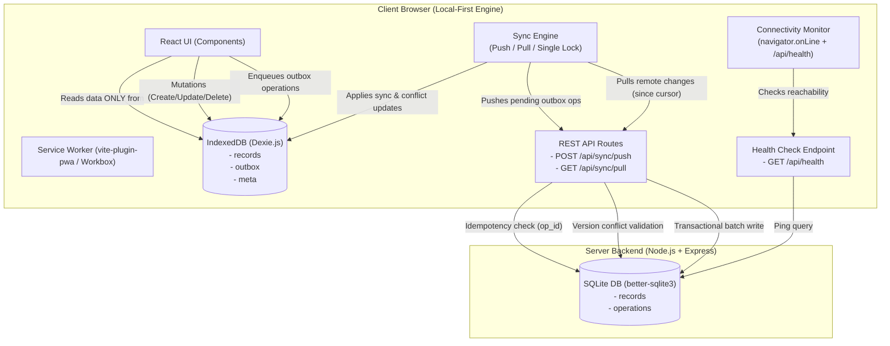

# Architecture Specification — ALG-WEB-02 Offline-First Application

## 1. Project Purpose

**Application:** Offline-First Notes & Tasks Manager  
**Project:** ALG-WEB-02  
**Hackathon Constraint:** One-day implementation (~8 hours); prioritizes correct offline behavior, idempotent synchronization, version-based conflict handling, and clear UX over unnecessary abstractions.

The primary goal of this application is to guarantee seamless offline functionality. Users can create, update, and soft-delete notes and tasks without network connectivity. All user actions instantly reflect in the UI via local storage, while background processes handle synchronization, conflict detection, and server persistence when online.

---

## 2. Architecture Overview

The system uses a **Local-First** architecture. The React user interface reads application state **exclusively from IndexedDB**. Components never perform direct API fetch calls to retrieve application records. Network synchronization updates IndexedDB, and the UI reactively updates in response to IndexedDB changes.



---

## 3. Data Models

### 3.1 Local Data Model (IndexedDB via Dexie.js)

#### `records` Table
Primary local store for application data.

| Field | Type | Description |
|---|---|---|
| `id` | `string` (UUID) | Client-generated primary key |
| `title` | `string` | Note/Task title |
| `content` | `string` | Note/Task body content |
| `type` | `'note' \| 'task'` | Record classification |
| `updatedAt` | `string` (ISO 8601) | Client timestamp of last mutation |
| `version` | `number` (integer) | Server-owned version number (0 = un-synced local creation) |
| `deleted` | `boolean` | Soft-delete tombstone flag |
| `pending` | `boolean` | Flag indicating unpushed local mutations exist |
| `conflict` | `boolean` | Flag indicating version conflict detected with server |
| `serverRecord` | `object \| null` | Snapshot of server record returned during 409 conflict |

#### `outbox` Table
Queue representing uncommitted local mutations.

| Field | Type | Description |
|---|---|---|
| `opId` | `string` (UUID) | Unique operation identifier for idempotency |
| `recordId` | `string` (UUID) | Associated record ID |
| `type` | `'create' \| 'update' \| 'delete'` | Mutation type |
| `payload` | `object` | Record state snapshot associated with operation |
| `baseVersion` | `number` (integer) | Server version known at time of local mutation |
| `timestamp` | `string` (ISO 8601) | Timestamp operation was created |
| `status` | `'pending' \| 'processing' \| 'failed'` | Execution status |
| `retryCount` | `number` | Count of failed transmission retries |
| `lastError` | `string` (optional) | Error message from last failure |

#### `meta` Table
Key-value configuration store.

| Key | Value Type | Description |
|---|---|---|
| `'lastSyncedAt'` | `string` (ISO 8601) | Server timestamp cursor of last successful pull sync |

---

### 3.2 Server Data Model (SQLite via `better-sqlite3`)

#### `records` Table

```sql
CREATE TABLE IF NOT EXISTS records (
  id TEXT PRIMARY KEY,
  title TEXT NOT NULL,
  content TEXT NOT NULL,
  type TEXT NOT NULL DEFAULT 'note',
  version INTEGER NOT NULL DEFAULT 1,
  updated_at TEXT NOT NULL,
  deleted INTEGER NOT NULL DEFAULT 0
);
```

#### `operations` Table

```sql
CREATE TABLE IF NOT EXISTS operations (
  op_id TEXT PRIMARY KEY,
  record_id TEXT NOT NULL,
  processed_at TEXT NOT NULL
);
```

---

## 4. API Contract

The API contract consists of three explicit REST endpoints:

### 4.1 `GET /api/health`
Verifies server reachability and SQLite database connectivity.

- **Response Status:** `200 OK` (or `503 Service Unavailable`)
- **Response Body:**
```json
{
  "status": "ok",
  "timestamp": "2026-10-04T12:00:00.000Z",
  "database": "connected"
}
```

### 4.2 `POST /api/sync/push`
Processes a batch of outbox mutation operations atomically.

- **Request Body:**
```json
{
  "operations": [
    {
      "opId": "c39a8b12-...",
      "recordId": "f72e91a4-...",
      "type": "update",
      "payload": {
        "id": "f72e91a4-...",
        "title": "Updated Title",
        "content": "Updated content text",
        "type": "note",
        "updatedAt": "2026-10-04T12:05:00.000Z",
        "deleted": false
      },
      "baseVersion": 1,
      "timestamp": "2026-10-04T12:05:00.000Z"
    }
  ]
}
```
- **Response Status:** `200 OK` (if all operations succeed or are ignored) or `409 Conflict` (if any operation encounters a stale baseVersion).
- **Response Body:**
```json
{
  "results": [
    {
      "opId": "c39a8b12-...",
      "recordId": "f72e91a4-...",
      "status": "applied",
      "newVersion": 2
    },
    {
      "opId": "e14b2d99-...",
      "recordId": "a18c43f0-...",
      "status": "conflict",
      "error": "Stale base version 1. Current server version is 2.",
      "serverRecord": {
        "id": "a18c43f0-...",
        "title": "Remote Version",
        "content": "Remote content edit",
        "type": "note",
        "version": 2,
        "updatedAt": "2026-10-04T12:04:00.000Z",
        "deleted": false
      }
    }
  ],
  "processedAt": "2026-10-04T12:05:01.000Z"
}
```

### 4.3 `GET /api/sync/pull?since=<ISO_TIMESTAMP>`
Fetches all remote record modifications updated after the `since` cursor.

- **Query Parameters:** `since` (optional ISO 8601 timestamp string).
- **Response Status:** `200 OK`
- **Response Body:**
```json
{
  "records": [
    {
      "id": "f72e91a4-...",
      "title": "Updated Title",
      "content": "Updated content text",
      "type": "note",
      "version": 2,
      "updatedAt": "2026-10-04T12:05:00.000Z",
      "deleted": false
    }
  ],
  "serverTime": "2026-10-04T12:05:02.000Z"
}
```

---

## 5. Key System Workflows

### 5.1 Local Mutation & Outbox Flow
1. User interacts with UI to create, update, or soft-delete a record.
2. App generates a client UUID for new records (`crypto.randomUUID()`).
3. Inside a single Dexie transaction, the application:
   - Writes the record to IndexedDB `records` table with `pending = true`.
   - Enqueues a corresponding mutation operation into the IndexedDB `outbox` table.
4. UI instantly updates via Dexie `useLiveQuery`.

### 5.2 Push Synchronization & Idempotency Flow
1. Sync Engine checks connectivity and acquires the single-sync execution lock (`isSyncingLock`).
2. Reads pending outbox operations ordered by `timestamp ASC`.
3. Sends `POST /api/sync/push`.
4. Server evaluates each operation inside a SQLite transaction:
   - **Idempotency Check:** If `opId` already exists in `operations` table, return `status: "ignored"` and skip re-applying.
   - **Conflict Check:** If record exists and `op.baseVersion !== serverRecord.version`, mark operation as `status: "conflict"`, attach current server record snapshot, and trigger HTTP `409 Conflict` response code.
   - **Apply Mutation:** If valid, increment server version (`newVersion = version + 1`), write record, insert `opId` into `operations`, and return `status: "applied"`, `newVersion`.
5. Client processes response:
   - Removes `applied` and `ignored` operations from local `outbox` table.
   - Updates local record `version` and clears `pending` flag.
   - For `conflict` items, marks local record `conflict = true` and attaches `serverRecord` snapshot.

### 5.3 Conflict Surfacing & Resolution Flow
Stale mutations **must never silently overwrite** server data.
When a conflict occurs:
1. The local record is flagged with `conflict = true` and stores the `serverRecord` snapshot.
2. The UI displays a prominent conflict badge and action button.
3. User opens the interactive **Conflict Resolution Dialog**, presenting a side-by-side diff:
   - **Keep Mine (Keep Local):** Updates baseVersion to current server version and re-queues an update outbox operation.
   - **Accept Server (Keep Theirs):** Overwrites local record with server snapshot and clears pending outbox operations for that record.
   - **Merge Manually:** Combines local and server content into a unified record, updates baseVersion to server version, and queues a new sync operation.

### 5.4 Pull Synchronization & Cursor Flow
1. Reads `lastSyncedAt` from IndexedDB `meta` table.
2. Sends `GET /api/sync/pull?since=<lastSyncedAt>`.
3. Server returns modified records and `serverTime`.
4. For each remote record:
   - If local record has pending unpushed changes (`pending === true`) or an unresolved conflict, do not silently overwrite local edits; surface version conflict if versions mismatch.
   - Otherwise, update local record with remote record state.
5. Store returned `serverTime` in IndexedDB `meta` as new `lastSyncedAt` cursor.

### 5.5 Connectivity Strategy
- **Browser State vs Server Reachability:** Separate concerns. `navigator.onLine` only reports local network connection. Real reachability is verified via periodic `GET /api/health` pings.
- **Sync Safety:** Single execution lock (`isSyncingLock`) prevents concurrent duplicate sync triggers (e.g. rapid Sync button clicks).
- **Retries:** Bounded exponential backoff (1s, 2s, 4s, 8s, up to 30s max).

---

## 6. Important Technical Decisions & Rationale (WHY)

1. **IndexedDB as UI Source of Truth:**
   - *WHY:* Guarantees 100% offline usability. The UI is decoupled from network latencies and failures.
2. **Client-Generated UUIDs:**
   - *WHY:* Enables offline creation of records without waiting for server-assigned auto-increment IDs.
3. **Outbox Pattern:**
   - *WHY:* Preserves ordering and details of all uncommitted local mutations, guaranteeing eventual consistency.
4. **Soft Deletes (Tombstones):**
   - *WHY:* Prevents deleted records from reappearing when pulling remote changes before deletion sync completes.
5. **Idempotent Operations (`opId`):**
   - *WHY:* Ensures network retries or duplicate transmissions do not cause duplicated records or corrupted state on the server.
6. **Server-Owned Integer Versions:**
   - *WHY:* Simple, deterministic conflict detection without clock-drift hazards inherent to timestamp-only comparison.

---

## 7. Major Edge Cases Handled

| Edge Case | Strategy / Behavior |
|---|---|
| **Editing same record on two offline devices** | Version conflict (`baseVersion !== server version`) is detected upon push; server returns HTTP 409 and snapshot; UI surfaces comparative resolution dialog. |
| **Local edit followed by remote delete** | Remote delete sets tombstone on server (`deleted = 1`); pull sync detects version change and surfaces conflict to user. |
| **Create then delete before first sync** | Special local handling: if `version === 0` (never synced), deleting the record immediately removes the local record and cancels all pending outbox operations without pushing to server. |
| **Multiple offline edits to same record** | Outbox stores sequential mutations; push batch applies changes sequentially or detects conflict on first stale mutation. |
| **Connection loss during synchronization** | Transactions roll back cleanly; bounded exponential backoff retries sync upon reconnection. |
| **Duplicate Sync button clicks** | Single-execution lock (`isSyncingLock`) ignores redundant sync requests while sync is active. |
| **Server unavailable while browser reports online** | `connectivityMonitor` health checks detect `/api/health` failure, marking server as unreachable while maintaining offline operation. |
| **First load while completely offline** | App loads via PWA service worker cache; IndexedDB initializes empty tables; UI remains responsive. |
